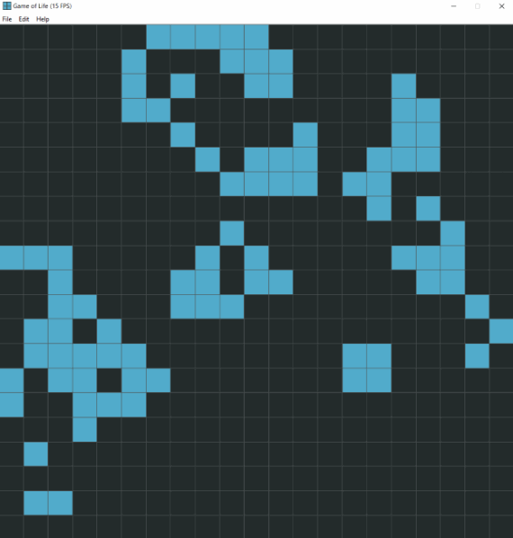
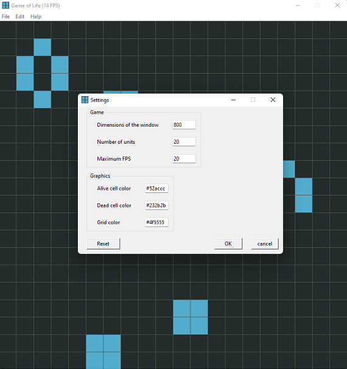

# Game of life
Visualization of Conway's Game of Life with Python and Tkinter. 




## How to install
The package can be installed with `pip` (v19.0 or higher) straight from the repository.

```pip install git+https://github.com/kuchynkm/game_of_life.git```

## How to use 

### Running the game
Once the package is installed, you can run the game by executing

```python -m game_of_life```

### Keyboard shortcuts
* `SPACEBAR` or `P`: pauses/unpauses the game
* `R`: restarts the game 
* `N`: pauses the game (unless already paused) and performs next step of the cell evolution
* `E`: erases all living cells
* `S`: opens a window with game settings
* `A`: opens a window with basic info about the game
* `Q`: closes the game

### Manual cell editting
The cells can be directly editted with mouse. 
After clicking on a canvas, the game will pause and you're entering the edit mode. 

By left-click on a cell, it becomes alive. Right-click causes alive cell to die. 

To perform next evolution step, hit `N`.

To exit the edit mode, unpause the game by hitting `SPACEBAR` or `P`.

### Settings

It is possible to change appearance as well as behavior to an extent.


